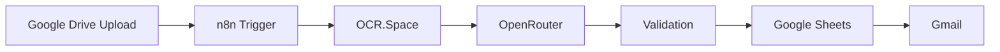

# Architecture Overview

This project uses a simple event-driven workflow to process invoices from upload through extraction, validation, logging, and notification.

## Workflow Diagram

## Stage-by-Stage Explanation

### 1. Google Drive Upload

The process begins when a user uploads an invoice file to a designated Google Drive folder. This folder acts as the intake point for incoming invoices.

### 2. n8n Trigger

`n8n` monitors the target Google Drive folder and starts the workflow when a new file appears. It captures the file metadata and prepares the document for the next step.

### 3. OCR.Space

The uploaded file is sent to `OCR.Space` so the invoice text can be extracted from the PDF or image. This step turns the document into machine-readable content.

### 4. OpenRouter

The extracted OCR text is passed to OpenRouter with a structured prompt. The model returns normalized invoice fields such as vendor name, invoice number, dates, currency, and totals.

### 5. Validation

The workflow checks whether the returned data is usable. It verifies that the response is valid JSON and that important fields such as invoice number and total amount are present and properly formatted.

### 6. Google Sheets

Once validated, the invoice data is written into Google Sheets. This sheet acts as a lightweight record of processed invoices and gives the finance team an easy place to review results.

### 7. Gmail

After the invoice is logged, Gmail sends a notification to confirm success or report an issue that requires manual review.

## Design Summary

This architecture is intentionally simple and interview-friendly. It demonstrates:

- event-driven workflow automation
- OCR-based document reading
- AI-assisted data extraction
- basic validation and exception control
- downstream business logging and notification

The result is a practical invoice automation pattern that is easy to explain, demo, and extend.
